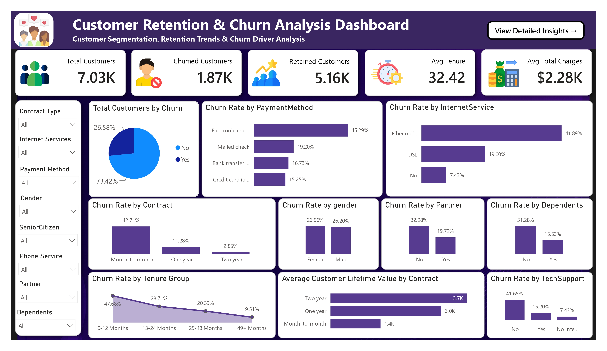

# 📊 Customer Retention & Churn Analysis Dashboard

<div align="center">


<h1>📈 Customer Retention & Churn Analysis Dashboard</h1>

<p>
A comprehensive customer retention and churn analytics project completed as part of the <b>Future Interns Data Science & Analytics Internship Program</b>. This project analyzes customer behavior, churn patterns, retention drivers, and customer lifetime value using Power BI to generate actionable business insights and recommendations.
</p>

</div>

---

## 🖼️ Dashboard Preview

### Dashboard Overview



### Insights & Recommendations


---

## ✨ Features

### 📊 Customer Churn Analysis

* Churn Rate Analysis
* Customer Retention Tracking
* Customer Segmentation
* Churn Driver Identification

### 👥 Customer Retention Insights

* Contract Type Analysis
* Internet Service Analysis
* Payment Method Analysis
* Customer Behavior Analysis

### 💰 Customer Lifetime Value Analysis

* Customer Lifetime Value (CLV)
* Contract-wise CLV Comparison
* Revenue Impact Assessment

### 📈 Retention Trend Analysis

* Tenure Group Analysis
* Customer Lifecycle Evaluation
* Retention Performance Monitoring

### 📋 Business Recommendations

* Churn Reduction Strategies
* Retention Improvement Plans
* Revenue Optimization Recommendations

---

## 🎯 Project Objective

The primary objective of this project is to analyze customer churn behavior and identify key retention drivers that can help businesses improve customer loyalty and reduce customer loss.

The analysis focuses on:

* Customer Churn Patterns
* Retention Drivers
* Customer Lifetime Value
* Customer Segmentation
* Revenue Impact of Churn
* Business Recommendations

---

## 📂 Dataset Overview

The project utilizes the Telco Customer Churn Dataset.

### Dataset Information

| Metric             |                  Value |
| ------------------ | ---------------------: |
| Total Customers    |                  7,043 |
| Churned Customers  |                  1,869 |
| Retained Customers |                  5,174 |
| Churn Rate         |                 26.58% |
| Retention Rate     |                 73.42% |
| Dataset Type       | Subscription / Telecom |

### Dataset Attributes

* Customer Demographics
* Contract Information
* Internet Services
* Payment Methods
* Monthly Charges
* Total Charges
* Customer Tenure
* Churn Status

---

## 🎯 Business Questions Addressed

This analysis aims to answer several critical business questions:

* Why are customers leaving the platform?
* Which customer segments have the highest churn risk?
* Which factors influence customer retention?
* How does tenure affect churn behavior?
* Which contract types generate the highest customer value?
* How can churn be reduced through data-driven strategies?

---

## 📊 Key Performance Indicators

| KPI                             |        Value |
| ------------------------------- | -----------: |
| Total Customers                 |        7,043 |
| Churned Customers               |        1,869 |
| Retained Customers              |        5,174 |
| Churn Rate                      |       26.58% |
| Average Tenure                  | 32.42 Months |
| Average Customer Lifetime Value |       $2.28K |

---

## 🏗️ Analysis Workflow

```text
┌──────────────────────┐
│ Telco Customer Data  │
└──────────┬───────────┘
           │
           ▼
┌──────────────────────┐
│ Data Cleaning        │
│ Power Query          │
└──────────┬───────────┘
           │
           ▼
┌──────────────────────┐
│ Data Modeling        │
│ DAX Measures         │
└──────────┬───────────┘
           │
           ▼
┌──────────────────────┐
│ Dashboard Creation   │
│ Power BI             │
└──────────┬───────────┘
           │
           ▼
┌──────────────────────┐
│ Business Insights    │
└──────────┬───────────┘
           │
           ▼
┌──────────────────────┐
│ Recommendations      │
└──────────────────────┘
```

---

## 📈 Dashboard Analysis

### Customer Churn Analysis

* Churn Distribution Analysis
* Churn Rate by Contract Type
* Churn Rate by Internet Service
* Churn Rate by Payment Method

### Customer Retention Analysis

* Customer Tenure Analysis
* Partner & Dependents Analysis
* Tech Support Impact Analysis
* Retention Driver Evaluation

### Customer Lifetime Value Analysis

* Contract-wise CLV Analysis
* Revenue Impact Assessment
* Customer Value Segmentation

---

## 🔍 Key Findings

### 📉 Churn Patterns

* Month-to-Month contracts show the highest churn rate (42.71%).
* Customers within their first 12 months are most likely to churn.
* Fiber Optic customers have significantly higher churn than DSL customers.
* Electronic Check users exhibit the highest churn among payment methods.

### 💰 Customer Lifetime Value

* Two-Year contract customers generate the highest Customer Lifetime Value.
* Long-term customers contribute significantly more revenue than short-term customers.
* Customer value increases with tenure duration.

### 📈 Retention Drivers

* Contract Type is the strongest retention driver.
* Tech Support significantly improves retention.
* Long-term customer relationships reduce churn risk.

---

## 💡 Business Recommendations

### 1️⃣ Promote Long-Term Contracts

Encourage customers to move from Month-to-Month plans to annual or two-year contracts.

### 2️⃣ Improve Customer Onboarding

Strengthen engagement during the first 12 months to reduce early-stage churn.

### 3️⃣ Investigate Fiber Optic Churn

Analyze service quality, pricing, and customer satisfaction among Fiber Optic users.

### 4️⃣ Encourage Automatic Payments

Promote automatic payment methods to improve customer retention.

### 5️⃣ Bundle Tech Support Services

Offer bundled support plans to increase customer satisfaction and reduce churn.

---

## 🛠️ Tech Stack

| Technology         | Purpose                |
| ------------------ | ---------------------- |
| Power BI           | Dashboard Development  |
| Power Query        | Data Cleaning          |
| DAX                | KPI & Measure Creation |
| CSV Dataset        | Data Source            |
| Business Analytics | Insight Generation     |

---

## 📁 Project Structure

```bash
FUTURE_DS_02/
│
├── Dashboard/
│   ├── Customer_Retention_Churn.pbix
│   └── Customer_Retention_Churn_Report.pdf
│
├── Dataset/
│   └── WA_Fn-UseC_-Telco-Customer-Churn.csv
│
├── Images/
│   ├── Dashboard_Page1.png
│   └── Dashboard_Page2.png
│
└── README.md
```

---

## 📄 Project Deliverables

* Interactive Power BI Dashboard
* Customer Churn Analysis
* Retention Driver Analysis
* Customer Lifetime Value Analysis
* Business Recommendations
* Professional Dashboard Report

---

## 🎯 Internship Task

**Future Interns – Data Science & Analytics Internship**

### Task 2: Customer Retention & Churn Analysis

Analyze customer data to identify churn patterns, retention drivers, and customer lifetime trends for a subscription-based business and provide actionable recommendations to reduce customer loss.

---

## 👨‍💻 Author

**Priyam Singh**

Data Science & Analytics Intern
Future Interns Internship Program

GitHub: https://github.com/priyam-10

---

<div align="center">

### ⭐ If you found this project useful, please give it a star!

Built with ❤️ using Power BI, Power Query & DAX

</div>
